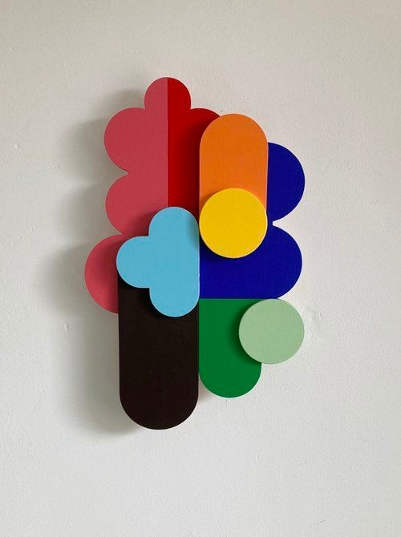
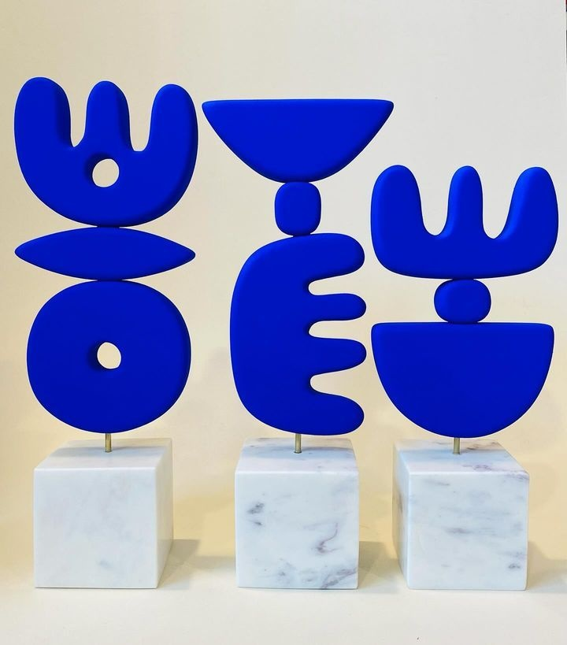
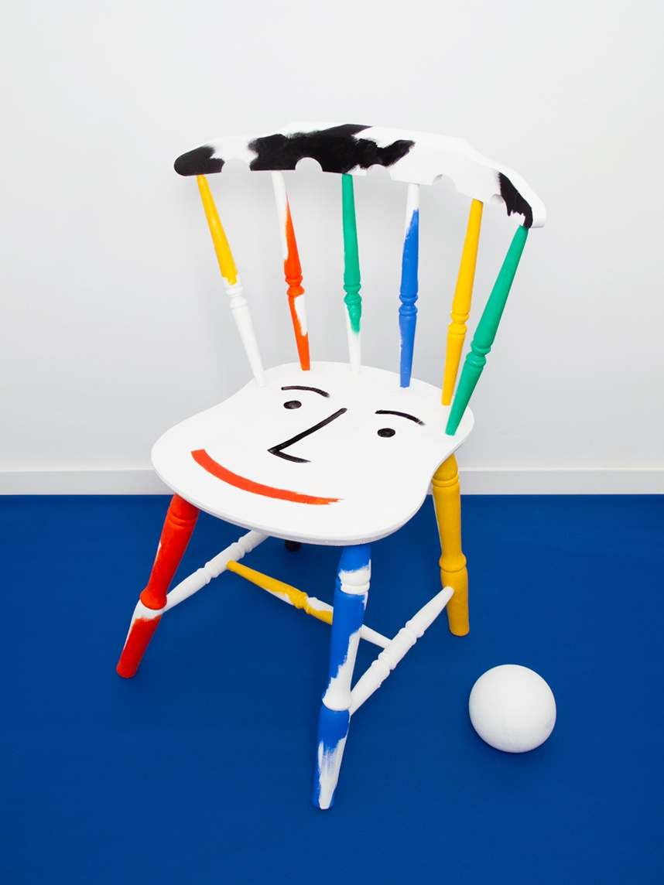
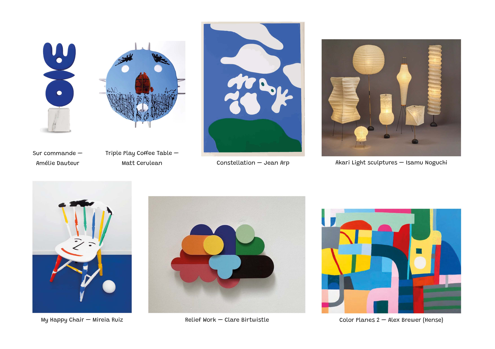

# Contexto de Design

## 1. Resumo / Abstract

### Resumo (PT)

Este projeto nasce da missão de criar objetos versáteis e sem funções predefinidas, onde a criança é a verdadeira autora da brincadeira. Através de quatro conceitos principais (personagens, ambientes, rostos e flores), exploramos a magia das formas orgânicas e das conexões inesperadas.
Cada peça é um convite à composição e à narrativa, permitindo que os mais pequenos construam mundos próprios onde o caos tem lógica e a imaginação é a única regra. 
### Abstract (EN)

This project stems from a mission to create versatile objects without predefined functions, where the child is the true creator of the play. Through four main concepts (characters, environments, faces, and flowers), we explore the magic of organic shapes and unexpected connections.
Each piece is an invitation to composition and storytelling, allowing little ones to build their own worlds where chaos has logic and imagination is the only rule.
## 2. Referências Coletivas

Na fase inicial do projeto, reunimos referências visuais de diversos objetos, que iam além do universo dos brinquedos, incluindo esculturas e peças de diferentes materiais. Através da partilha e discussão em grupo, identificámos os pontos comuns que nos inspiravam e definimos o nosso caminho. Como esta pesquisa inicial era muito abrangente, filtrámos as referências para garantir um conceito claro e coeso no nosso _moodboard_. Apresentamos, de seguida, as principais referências que moldaram a criação dos nossos produtos.

### 2.1. Recolha de Objetos a Redesenhar/Remisturar

O nosso objetivo nunca foi replicar brinquedos ou jogos existentes. Por isso, focámo-nos essencialmente na forma e na sensação que os objetos de referência nos transmitiam.

- **Objeto 1** — ***Milimbo***, estudo / Workshops in Valencia and prototypes for Fundació Joan Miró (2019) / Os brinquedos são modulares, transformáveis e refletem na perfeição o seu objetivo de proporcionar uma brincadeira sem limites

- **Objeto 2** — ***Relief Work***, Arte Abstrata / Artista e designer freelancer britânica *Clare Birtwistle* / Uso de formas geométricas limpas, paletas de cores contrastantes e uma forte abordagem minimalista e redutiva

- **Objeto 3** — ***Sur commande***, Escultura / *Amélie Dauteur*, artista visual e ceramista francesa / Peças com forte presença gráfica

- **Objeto 3** — ***MY HAPPY CHAIR***, Escultura / *Mireia Ruiz*, Artista e designer gráfico residente em Barcelona / Formas geométricas fortes, uma paleta de cores dinâmica e uma comunicação baseada na positividade visual
### 2.2. Moodboard

O _moodboard_ funcionou como a nossa ferramenta de curadoria e afunilamento conceptual. Nele, reunimos referências onde a forma e a restrição material coexistem em harmonia.

O painel visual sintetiza a essência estética do projeto, onde a escultura abstrata encontra o jogo livre. Através de referências que exploram volumes modulares, formas orgânicas inspiradas na natureza e traços antropomórficos minimalistas, definimos o tom da nossa coleção.

As principais palavras-chave que captam a essência do nosso moodboard:

- Biomórfico / Orgânico
- Abstração
- Modularidade / Camadas
- Expressividade Inocente
- Sensorial / Tátil
- Blocos de Cor (*Color Blocking*)
- Antropomorfismo Minimalista