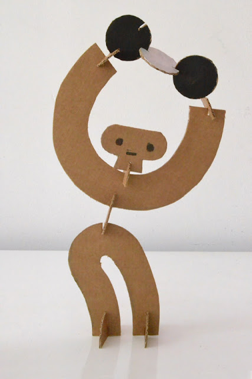
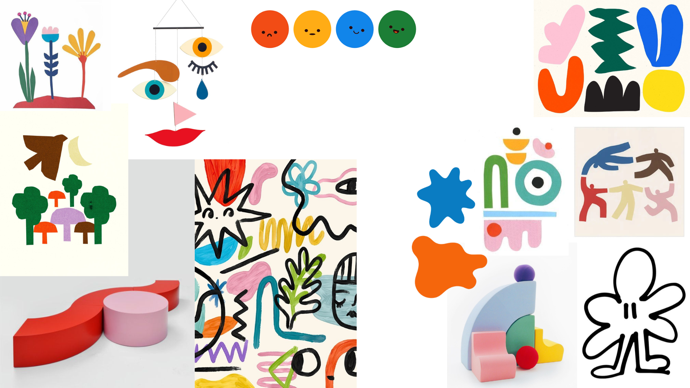

# Contexto de Design

Página explicativa do contexto, em concordância com a apresentação produzida em grupo. Componente de **grupo**.

## 1. Resumo / Abstract

> Máximo 500 palavras. Preferencialmente em **PT** e **EN**.

### Resumo (PT)

Este projeto nasce da missão de criar objetos versáteis e sem funções predefinidas, onde a criança é a verdadeira autora da brincadeira. Através de quatro conceitos principais (personagens, ambientes, rostos e flores), exploramos a magia das formas orgânicas e das conexões inesperadas. Cada peça é um convite à composição e à narrativa, permitindo que os mais pequenos construam mundos próprios onde o caos tem lógica e a imaginação é a única regra. Com uma forte presença de vitalidade através de cores vivas e energia, o brincar transforma-se num processo contínuo de descoberta. Aqui, o significado do jogo é totalmente aberto, oferecendo liberdade absoluta para explorar e criar.
### Abstract (EN)

This project is rooted in the mission to create versatile objects with no predefined functions, empowering children to be the true authors of their playtime. Through four main concepts (characters, ambiances, faces, and flowers), we explore the magic of organic shapes and unexpected connections. Each piece is an invitation to composition and narrative, allowing little ones to build their own worlds where chaos holds logic and imagination is the only rule. Driven by the vitality of vibrant colors and energy, playing transforms into a continuous journey of discovery. The meaning of the game is entirely open, providing ultimate freedom to explore and create.

## 2. Referências Coletivas

### 2.1. Recolha de Objetos a Redesenhar/Remisturar

Catálogo de objetos de partida que o grupo identificou para o redesenho. Para cada objeto: imagem, origem, motivo da escolha.

- **Objeto 1** — O estúdio "milimbo" / Workshops in Valencia and prototypes for Fundació Joan Miró (2019) / Os brinquedos são modulares, transformáveis e refletem na perfeição o seu objetivo de proporcionar uma brincadeira sem limites.

- **Objeto 2** — ...

### 2.2. Moodboard

Painel de referências visuais e conceptuais que orientam a estratégia do grupo.

