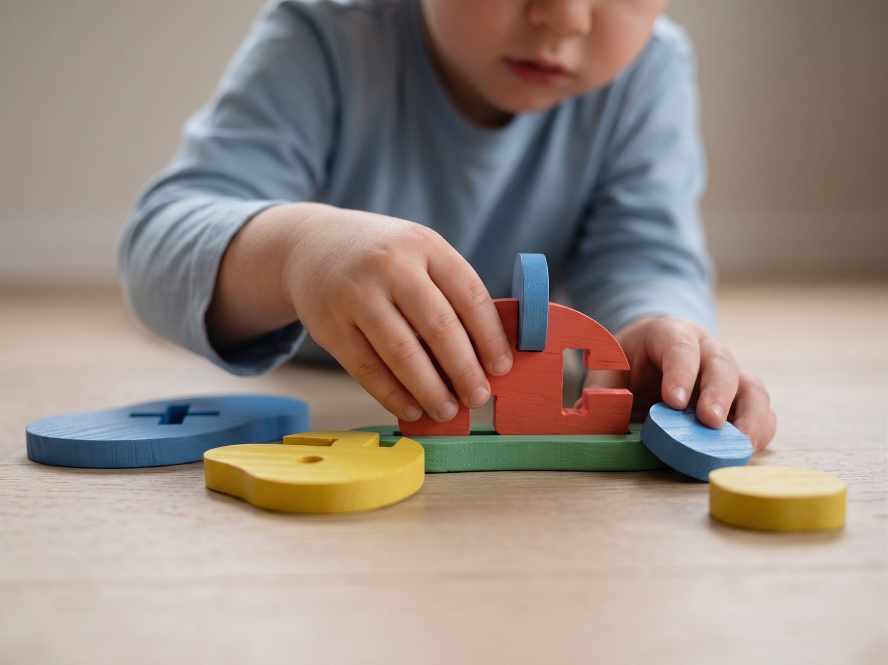
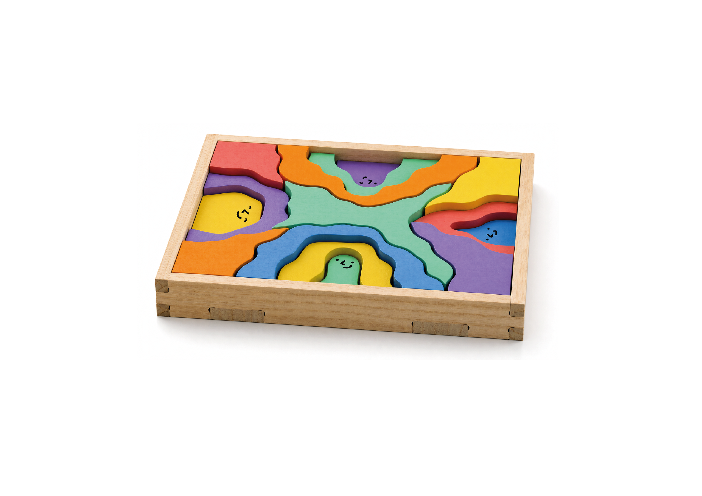
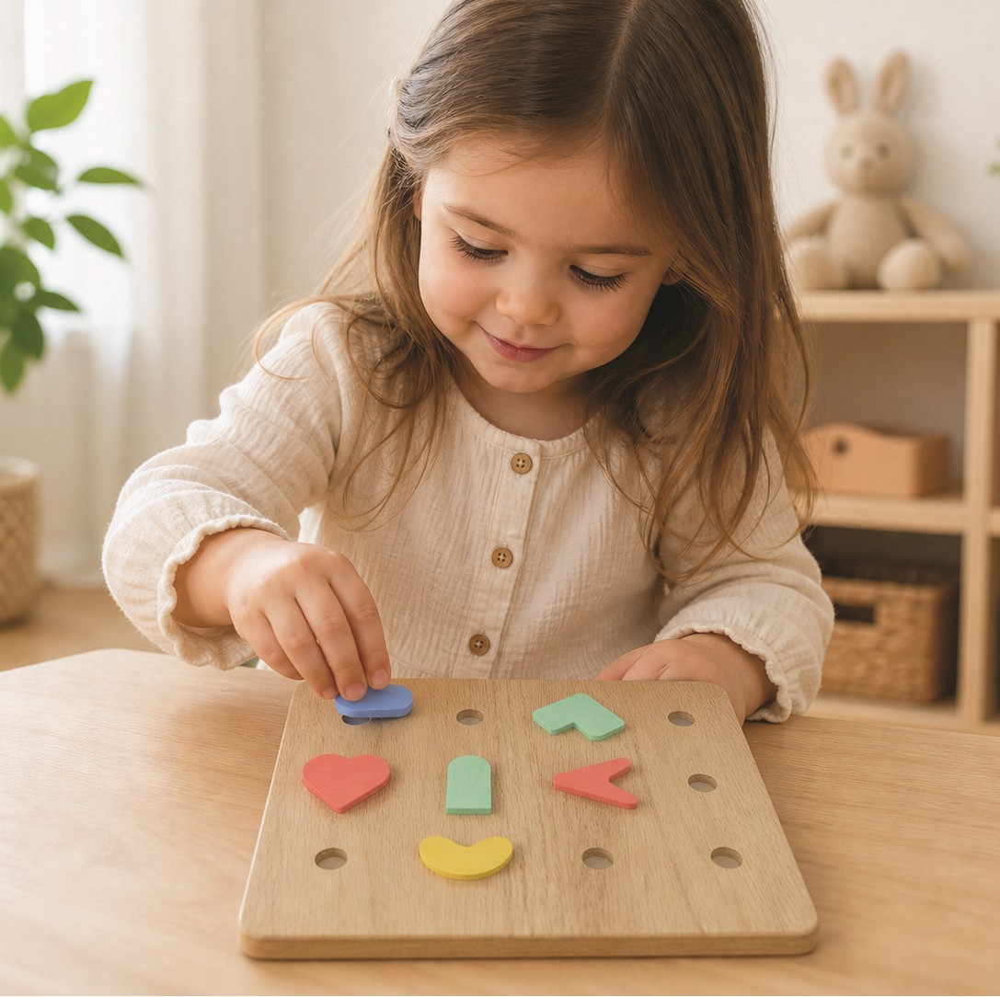
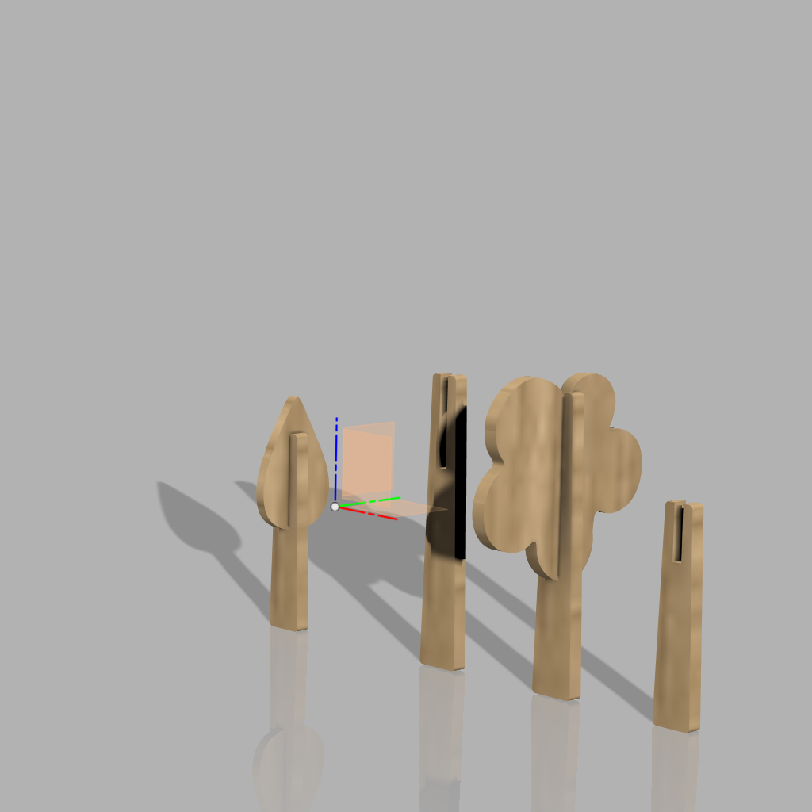

# Always Becoming

> *Desenvolvemos uma coleção de objetos táteis onde cada peça é o início de uma nova forma de brincar.*

## Elementos do Grupo

| Número  | Nome             |
| ------- | ---------------- |
| 2024307 | Ana Rita Queta   |
| 2024570 | Carolina Aniceto |
| 2024266 | Mariia Novytska  |
| 2024275 | Matilde Puga     |

---

## Contexto de Design

> Nesta zona pretenderão mostrar o que relaciona estes produtos que apresentam na galeria - a temática, conceito comum, objectivos comuns, brincadeiras (funções) comuns, entre outros...

Este projeto cria objetos versáteis e sem funções predefinidas, tornando a criança a verdadeira autora da brincadeira. Cada brinquedo traz consigo um tema ou uma restrição básica, uma moldura que define a regra inicial. A partir dessa estrutura, seja um personagem, um rosto, uma flor ou um ambiente, abre-se um espaço de total liberdade para explorar e inventar sem limites.

### Conceito e Função Gerais

A ligação essencial entre todas as peças é o equilíbrio entre estrutura e liberdade. O ponto de partida serve apenas como um gatilho para a criatividade, estimulando os mais pequenos a desenvolverem um raciocínio próprio a partir desse primeiro impulso. Os quatro universos partilham a mesma linguagem de formas orgânicas, garantindo que, embora cada proposta comece com um foco definido, as peças permaneçam conceptualmente abertas.

Funcionalmente, todos os artigos atuam como plataformas de desenvolvimento tátil e cognitivo. Independentemente do mote inicial, a verdadeira dinâmica do conjunto é servir de bloco de construção para empilhar, encaixar e transformar. O resultado final nunca é estático.

[Ver contexto completo →](contexto.md)

---

## Galeria de Produtos

<!-- Cada thumbnail liga à página individual de cada produto.
     Cada produto vive em produtos/<numero>-<nome>/index.md
     e tem uma sub-página produtos/<numero>-<nome>/processo.md -->

<!-- markdownlint-disable MD033 -->

  <!-- duplicar o bloco abaixo para cada produto do grupo -->

  <a class="gallery-card" href="produtos/2024266-mariia/">
    
    <h3>MORFY</h3>
    
Mariia Novytska

  </a>
    <a class="gallery-card" href="produtos/2024275-max/">
    
    <h3>WANDY</h3>
    
Max Puga

  </a>  <a class="gallery-card" href="produtos/2024570-carol/">
    
    <h3>LOOKY</h3>
    
Carolina

  </a>
    <a class="gallery-card" href="produtos/2024307-rita/">
    
    <h3>FLOWERY</h3>
    
Ana Rita

  </a>

  <!-- duplicar o bloco acima para cada produto do grupo  e substituir _modelo em ambas por <numero>-<nome> -->

<!-- markdownlint-enable MD033 -->
