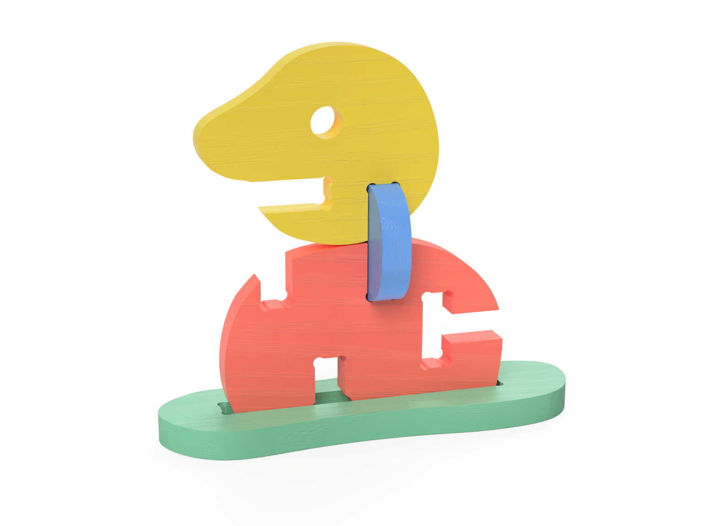

# morfy

<!--
  HERO: idealmente uma pseudo-sessão fotográfica do produto
  (ver tutorial Pletor.ai nos Recursos da disciplina, em
  /Recursos/AI_exps/). Usa attachments/hero.jpg para o frontmatter.
-->

> A liberdade de construir os teus próprios personagens.

A página deve tornar **visualmente percetível** a estratégia de resposta ao enunciado.
Segue a estrutura de **prancha-resumo** + **esquema-base** (C-E-T-F).

## Conceito

*Ideia central do produto. O que é, para quem, porquê.*

**Ideia central**
Construir fora da caixa. Um sistema onde a montagem abandona a simetria tradicional, guiando a criança através de linhas orgânicas para criar formas e personagens absolutamente inesperadas.

**O que é**
Um brinquedo modular impulsionado por um sistema inovador de "fendas" e "moedas" de conexão. Longe dos encaixes convencionais, as fendas fluem em harmonia com as curvas naturais de cada peça. Esta assimetria permite criar ângulos inusitados e composições que parecem ter vida própria.

**Para quem**

**Crianças:** Exploradores que desafiam a lógica e procuram total liberdade para inventar sem o limite das grelhas simétricas.
**Pais e Educadores:** Adultos que valorizam o pensamento divergente, a exploração tátil e um design de excelência que foge do óbvio.

**Porquê** 
Porque quebrar a simetria é o primeiro passo para a verdadeira criatividade. Ao interagir com encaixes que fluem de forma orgânica, a criança é incentivada a abandonar os padrões, explorando novas perspetivas espaciais e transformando a montagem livre numa narrativa única.

## Enquadramento

Posicionamento em relação ao contexto de grupo (ver [contexto](../../contexto.md)) e à recolha de objetos a redesenhar.

## Tecnologia

Material: oak, cnc, fusion

Materiais (espécie de madeira), processos de fabrico (CNC, laser, impressão 3D), software paramétrico, ficheiros técnicos.

- Modelo 3D: <!-- embed Fusion ou link a360.co -->
- Ficheiros: `attachments/`

## Função

Como se brinca, idade-alvo, montagem, conformidade com a Diretiva 2009/48/CE.

## Apresentação

Imagens-chave que sintetizam o produto final.

---

## Processo

O percurso completo de iterações, modelos e pesquisa está em [processo.md](processo.md), organizado do **mais recente** para o **mais antigo**.

[Ver processo completo →](processo.md)
