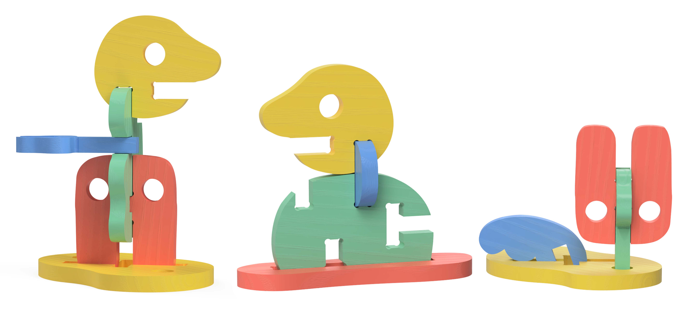

# MORFY

<!--
  HERO: idealmente uma pseudo-sessão fotográfica do produto
  (ver tutorial Pletor.ai nos Recursos da disciplina, em
  /Recursos/AI_exps/). Usa attachments/hero.jpg para o frontmatter.
-->

> A liberdade de construir os teus próprios personagens.
## Conceito

##### Ideia central

Construir fora da caixa. Um sistema onde a montagem abandona a simetria tradicional, guiando a criança através de linhas orgânicas para criar formas e personagens absolutamente inesperadas.

##### O que é

Um brinquedo modular assente num sistema aberto de conexões: fendas retas (_slots_) horizontais ou verticais unidas por moedas (_coins_), furos redondos para encaixe de chaves, e a possibilidade de união direta entre as peças. Longe dos encaixes convencionais e simétricos, o contraste entre a ortogonalidade das fendas e a fluidez das curvas naturais de cada peça permite criar ângulos inusitados e composições que ganham vida própria.

<!--
imagem 3 tipos de conexao
-->
##### Para quem

- **Crianças:** Exploradores que desafiam a lógica e procuram total liberdade para inventar sem o limite das grelhas simétricas.
- **Pais e Educadores:** Adultos que valorizam o pensamento divergente, a exploração tátil e um design de excelência que foge do óbvio.

##### Porquê 

Porque quebrar a simetria tradicional é o primeiro passo para a verdadeira criatividade. Ao interagir com regras de encaixe simples que contrastam com formas orgânicas, a criança é incentivada a abandonar padrões rígidos, explorando novas perspetivas espaciais e transformando a montagem livre numa narrativa única e autoral.

>**Renderização (Fusion 360):** Exemplos de montagem e exploração do *MORFY*
## Enquadramento

##### Posicionamento em relação ao [contexto](../../contexto.md) de grupo

O *MORFY* concretiza o conceito do grupo ao proporcionar um enquadramento temático centrado nas personagens, funcionando como o contexto ou "moldura" que define o ponto de partida da peça. Em consonância com a filosofia do coletivo, este enquadramento inicial não impõe um fim, mas serve como o impulso necessário para explorar infinitas possibilidades em aberto.

Dentro deste universo, *MORFY* introduz as suas próprias regras e limitações geométricas: um sistema modular baseado em ranhuras retas (horizontais ou verticais) e ligações por encaixe. É precisamente o contraste entre a rigidez destas ranhuras ortogonais e a fluidez das formas orgânicas das peças que cria assimetria e ângulos invulgares. Ao quebrar a simetria tradicional através de regras geométricas simples, o projeto posiciona-se no contexto do grupo como um facilitador do pensamento divergente, onde uma pequena limitação estrutural se torna o gatilho para que as crianças construam fora dos padrões estabelecidos.
## Tecnologia

##### Materiais

O material principal selecionado para o projeto é a **madeira de carvalho**. Esta espécie de madeira de folha caduca foi escolhida pela sua elevada densidade, resistência mecânica e durabilidade, qualidades fundamentais para resistir ao desgaste contínuo de um brinquedo modular de encaixe. Visualmente, o carvalho confere um acabamento texturado e orgânico através dos seus veios característicos, valorizando a componente tátil e a estética natural do objeto.
##### Processos de Fabrico
A produção do MORFY assenta num fluxo de fabrico digital focado na precisão e na segurança:
- **Corte CNC**
Processo único de fabrico utilizado para o corte e desbaste tridimensional de todas as componentes do brinquedo (peças orgânicas, moedas de conexão, fendas e furos redondos). A fresagem CNC garante uma precisão milimétrica na largura das ranhuras, assegurando a tolerância exata para os encaixes por pressão.
- **Pós-Processamento e Acabamento**
Lixagem manual rigorosa de todas as peças para o arredondamento de arestas vivas e eliminação de farpas, seguida da aplicação da pintura colorida com certificação de segurança para crianças.
##### Software Paramétrico
Todo o projeto foi idealizado e modelado digitalmente no software paramétrico Autodesk Fusion 360.
##### Ficheiros Técnicos e Modelo 3D
- Modelo 3D: 
https://a360.co/3S1agf1

- Ficheiros: 
Modelo 3D Principal - Autodesk Fusion 360
`attachments/MORFY.f3d`
Modelos de Teste
`attachments/MORFY Test1.f3d`
`attachments/MORFY Test2.f3d`
## Função

##### Como se brinca
A brincadeira com o *MORFY* assenta na exploração tátil livre e sem regras predefinidas (_open-ended play_). Sem a imposição de instruções ou de uma simetria rígida, a criança assume o papel de autora, sendo convidada a descobrir e a testar as suas próprias regras de construção.

>*Imagem gerada por Inteligência Artificial (Gemini)*
##### Idade-alvo

O faixa etária-alvo são crianças entre os 4 e os 5 anos de idade. Nesta faixa etária, a criança encontra-se no auge do jogo simbólico e do desenvolvimento do pensamento abstrato. O MORFY adequa-se perfeitamente a esta etapa, pois os miúdos já possuem a coordenação motora fina necessária para alinhar e pressionar as moedas nas fendas ortogonais, ao mesmo tempo que beneficiam de um brinquedo sem regras rígidas que estimula a criatividade e a narrativa visual (a criação dos seus próprios "personagens").
##### Montagem

A montagem é manual, aberta à exploração e sem ferramentas, baseando-se em três dinâmicas de encaixe: a ligação através do sistema de fendas e moedas (slots & coins), a união mecânica direta entre as próprias peças ou o encaixe de elementos finos (estilo "chaves") em furos redondos integrados no design. Sem instruções ou fixações permanentes, a criança é livre para experimentar e explorar todas as possibilidades de ligação, sendo incentivada a descobrir formas originais de fixar, conectar e estruturar as peças entre si.
##### Conformidade com a Diretiva 2009/48/CE

O *MORFY* cumpre os requisitos essenciais da Diretiva 2009/48/CE. Ao nível das Propriedades Físicas e Mecânicas (EN 71-1), o risco de asfixia é nulo, pois as moedas medem 60 x 60 mm, superando o limite de 31,7 mm do cilindro de teste de pequenas partes; as arestas em madeira CNC são também arredondadas para evitar superfícies cortantes ou farpas. Quanto às Propriedades Químicas (EN 71-3), o projeto prevê materiais seguros e acabamentos ecológicos não tóxicos (tintas e vernizes à base de água), garantindo a total segurança no contacto tátil prolongado.

## Apresentação

Imagens-chave que sintetizam o produto final.

---

## Processo

O percurso completo de iterações, modelos e pesquisa está em [processo.md](processo.md), organizado do **mais recente** para o **mais antigo**.

[Ver processo completo →](processo.md)
