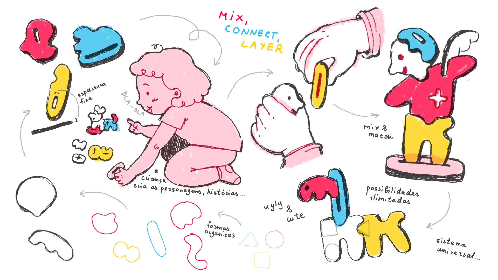
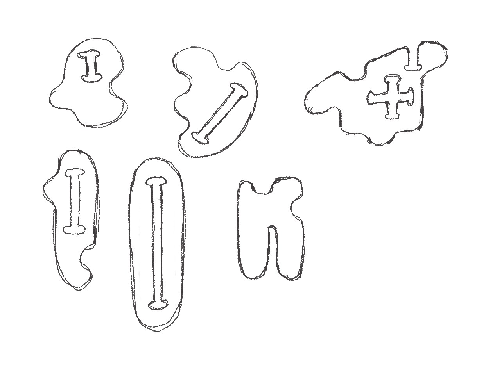
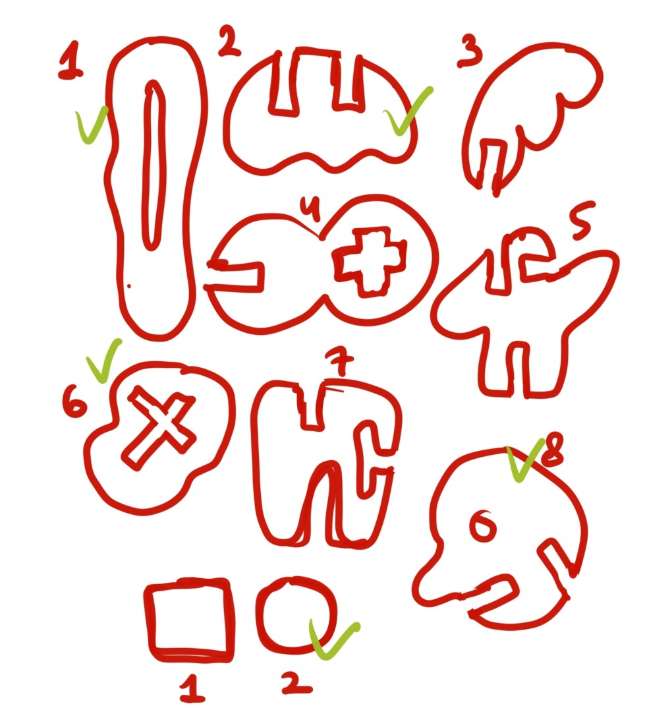
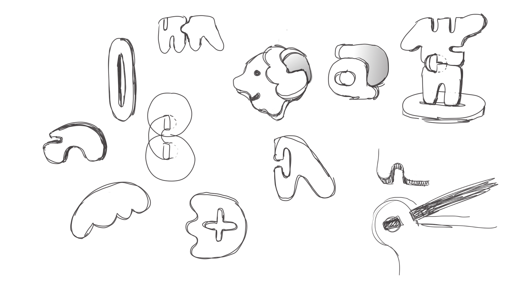
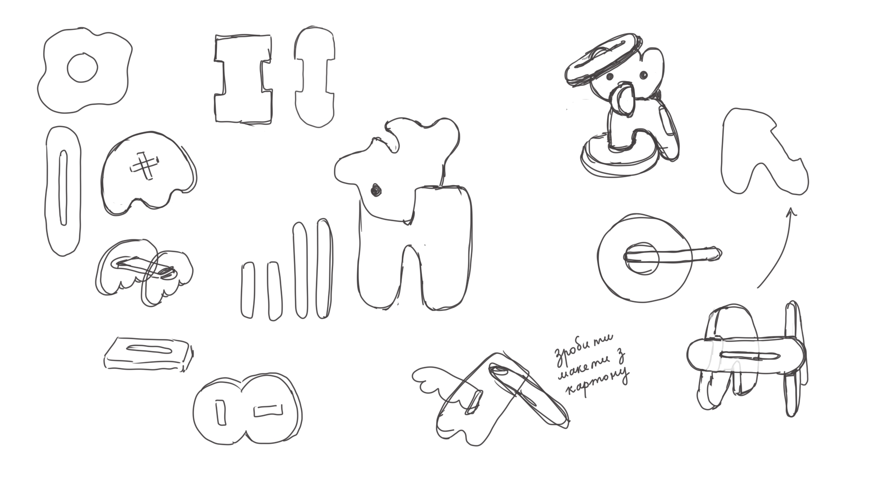

# Processo

> Organizado do **mais recente** para o **mais antigo**. Faz uma seleção que torne clara, aprazível e detalhada a evolução do produto e das ideias.

## 1. Modelos 3D

Embed do Fusion (visualização do modelo paramétrico).

https://a360.co/4nqYoPa

## 2. Outros Modelos

Modelos físicos exploratórios, em cartão, espuma, madeira de teste.

## 3. Esboços e Pranchas-Resumo

Desenhos manuais, 
pranchas A3 de síntese, 
exploração de variantes.

*Prancha-resumo inicial*

*Esboço das peças com dogbones*

*Esboço, escolha das peças*

*Esboços exploratorios da forma e função*

## 4. Pesquisa

### 5.1. Aspectos valorizados do moodboard, desconstrução da forma (o que distingue o programa formal)

### 6.2. Objetos de referencia

Inventário de precedentes, brinquedos análogos, referências históricas.

## 7. Outros Elementos

Outros materiais relevantes para a preparação do conceito (entrevistas, observação, testes com utilizadores, notas, leituras, inspirações).
