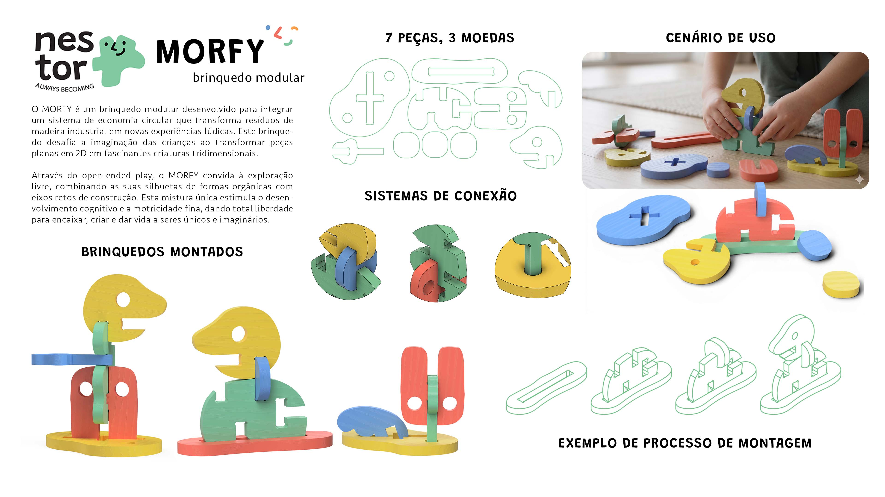
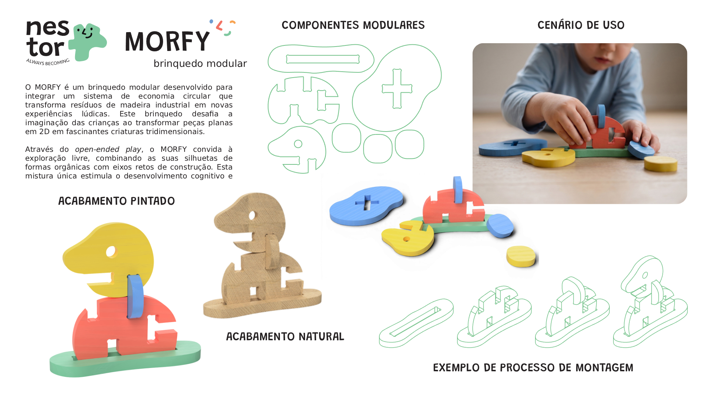
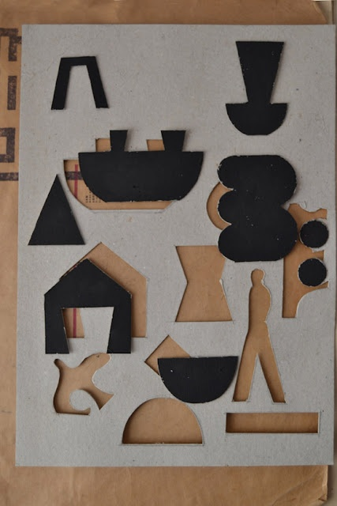

# Processo

## 1. Modelos 3D

#### Modelo 3D Principal - Autodesk Fusion 360

O modelo 3D final em Fusion divide-se em duas áreas: uma secção com exemplos de personagens montadas, que demonstra as possibilidades de jogo, e outra com as peças organizadas em plano horizontal, prontas para o corte em máquina.

Embed do Fusion (visualização do modelo paramétrico)
https://a360.co/3S1agf1

Criei vários ficheiros de teste no Fusion para experimentar formas e simular os encaixes das peças. Nesta fase, o foco principal foi acertar no desenho da moeda, encontrando o equilíbrio ideal entre um encaixe simples e uma estrutura firme.
#### Modelos de Teste
https://a360.co/4xaqC5e

https://a360.co/4ab5gL4

#### Ficheiros
Modelo 3D Principal - Autodesk Fusion 360
`attachments/MORFY.f3d`

Modelos de Teste
`attachments/MORFY Test1.f3d`
`attachments/MORFY Test2.f3d`
## 3. Pranchas-Resumo

A prancha final foi aperfeiçoada após receber o feedback, tendo sido acrescentadas mais peças para demonstrar de forma clara o conceito das múltiplas combinações de construção. Foram também integradas imagens que ilustram os três métodos de conexão do sistema: através de moedas, por encaixe direto entre as próprias peças e através da combinação de furos e chaves.

> *Prancha-resumo de apresentação (versão atualizada)*

> *Prancha-resumo de apresentação (1ª versão)*

## 3.1 Esboços

Durante a fase de experimentação, realizei vários esboços para explorar o potencial do sistema. Embora as possibilidades morfológicas fossem infinitas, selecionei um conjunto de formas-base estratégicas para demonstrar como é simples e intuitivo criar um objeto assente no jogo livre. 

Durante esta fase, também foi necessário repensar o sistema de união entre as peças. Com base no _feedback_ do professor, decidi abandonar os encaixes do tipo puzzle e transitar para um sistema de moedas (_coins_) e ranhuras (_slots_).

> *Esboço, escolha das peças*

Defini o conjunto final de peças e atribuí-lhes nomes técnicos. Estas denominações não procuram limitar o significado de cada elemento, servindo apenas como guia prático para as instruções ou para a lista de componentes na caixa do brinquedo.

- ***Stick*:** Uma das peças principais para servir de base. Devido ao seu tamanho maior e à largura da sua ranhura, é ideal para empilhar e suportar outros componentes do sistema.
- ***Blob1 e Blob2*:** Os elementos mais abstratos de toda a coleção. Foram desenhados sem qualquer associação visual óbvia.
- ***Head*:** Embora a sua silhueta se assemelhe a uma cabeça, revela-se muito mais versátil do que parece. O seu furo redondo foi pensado para servir de encaixe à peça *Key*.
- ***Legs*:** Um elemento que muda consoante a perspetiva espacial. Dependendo do ângulo da montagem, pode ser interpretado como um par de pernas ou como uma cabeça dotada de orelhas compridas.
- ***Key*:** A peça utilitária do conjunto. Funciona tanto como um conector mecânico para unir diferentes componentes como um acessório narrativo para caracterizar o personagem.
- ***Wing*:** Uma forma fluida e orgânica com múltiplas leituras, transformando-se facilmente numa asa, numa mão, numa cauda ou em cabelo, conforme o rumo da brincadeira.

> *Prancha-resumo inicial*

> *Esboços exploratorios da forma e função*

## 4. Pesquisa

A pesquisa para o MORFY partiu do universo visual abstrato do grupo e focou-se no estudo de estruturas que transitam da bidimensionalidade para o espaço tridimensional, inspiradas em brinquedos de cartão recortado. O objetivo foi desenhar um sistema modular volumétrico que se armazena de forma totalmente plana, valorizando a forma pura e o estímulo tátil em vez de regras predefinidas. Diante de possibilidades infinitas, a investigação refinou o conceito até encontrar as formas-base ideais para demonstrar o potencial deste sistema aberto.

## 5. Aspectos valorizados do moodboard, desconstrução da forma 

A partir do _moodboard_ desenvolvido pelo nosso coletivo, resgatei os elementos-chave que unem todos os nossos projetos: as formas orgânicas, o uso de cores primárias e uma forte componente de diversão. Foquei-me em silhuetas abertas à interpretação, desenhadas especificamente para desafiar a criança a pensar e a adivinhar o que cada uma daquelas formas significa para si mesma.

## 6. Objetos de referencia

A minha principal referência partiu dos brinquedos de cartão recortado que transitam do plano bidimensional para o tridimensional. Este tornou-se o conceito central do MORFY: a ideia de um brinquedo modular que ganha volume e ocupa o espaço, mas que pode ser facilmente guardado em formato 2D. 

- **Objeto 1** — ***Milimbo***, estudo / [Workshops in Valencia and prototypes for Fundació Joan Miró (2019)](https://milimboblog.blogspot.com/2019/01/keep-on-playing.html) / Os brinquedos são modulares, transformáveis e refletem na perfeição o seu objetivo de proporcionar uma brincadeira sem limites