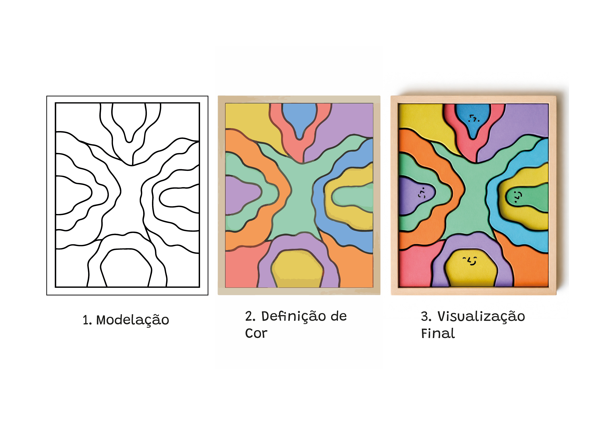

# Processo

> Organizado do **mais recente** para o **mais antigo**. Faz uma seleção que torne clara, aprazível e detalhada a evolução do produto e das ideias.

## 1. Protótipo(s)

## 2. Processo de Prototipagem

## 3. Modelos 3D do Molde

## 4. Protótipos Exploratórios

Embed do Fusion (visualização do modelo paramétrico).

https://a360.co/4nqYoPa

## 5. Modelos 3D

Modelos físicos exploratórios, em cartão, espuma, madeira de teste.

## 6. Esboços e Pranchas-Resumo

>1º Prancha-Resumo
## 7. Pesquisa

### 7.1. Aspectos Valorizados do Moodboard

O moodboard inicial não se centrou exclusivamente no universo dos brinquedos, mas numa recolha mais ampla de referências visuais ligadas ao mobiliário, à escultura, à pintura e ao design. Entre os aspetos mais valorizados destacaram-se as formas orgânicas, a irregularidade controlada, a repetição com variação e a capacidade de gerar composições visualmente equilibradas a partir de elementos simples.

Ao longo do processo, estas referências foram sendo desconstruídas e traduzidas para um vocabulário formal próprio. Em vez de recorrer a figuras reconhecíveis ou geometrias rígidas, o WANDY foi desenvolvido a partir de formas ambíguas e não hierarquizadas, capazes de coexistir sem sugerir uma única leitura. O que distingue o seu programa formal é precisamente a ausência de uma função evidente: nenhuma peça assume um papel dominante e todas podem adquirir significados distintos consoante a relação estabelecida entre elas.

A introdução de três alturas diferentes reforça esta lógica, acrescentando profundidade e variação às composições sem comprometer a simplicidade do sistema.

>1º MoodBoard de Grupo
### 7.2. Objetos de referencia

Inventário de precedentes, brinquedos análogos, referências históricas.

## 9. Outros Elementos

Para além da pesquisa visual e da análise de precedentes, foram consideradas decisões relacionadas com a identidade visual da marca. A paleta cromática foi definida coletivamente, procurando um equilíbrio entre cores vivas e neutras, suficientemente cativantes para o universo infantil sem remeter para associações de género específicas.

As expressões gráficas integradas em algumas peças surgiram como uma forma de lhes atribuir personalidade e reforçar o potencial narrativo do brinquedo. Ao poderem ser apropriadas como personagens, estas peças estabelecem uma relação mais próxima e afetiva com os utilizadores. No entanto, as expressões encontram-se presentes apenas numa das superfícies de cada peça, criando uma dualidade entre figura e forma abstrata: dependendo da orientação escolhida pela criança, a mesma peça pode assumir uma identidade própria ou integrar-se na composição sem qualquer significado explícito.

O rosto recortado na base da caixa corresponde ao símbolo da marca e surgiu como uma estratégia de reforço da sua identidade visual, permitindo estabelecer uma ligação imediata entre o produto e o universo gráfico que o acompanha. Este detalhe procura tornar a marca reconhecível e consistente ao longo das diferentes aplicações dos seus produtos, demonstrando como decisões aparentemente secundárias podem também contribuir para a construção da experiência global do brinquedo.

Desta forma, o WANDY afirma-se não apenas como um conjunto de peças, mas como um sistema aberto onde materialidade, identidade visual e processo de fabrico participam igualmente na definição da experiência de brincar.

