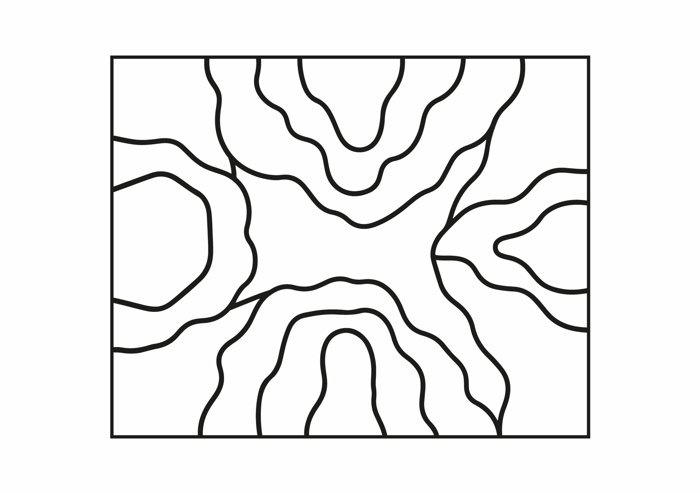

# Processo

> 

## 1. Desenvolvimento Formal

O desenvolvimento formal do WANDY iniciou-se através do desenho manual do padrão das peças à escala real. Posteriormente, as formas foram vetorizadas em Adobe Illustrator e convertidas em ficheiros SVG para integração no Autodesk Fusion 360.

Este processo permitiu ajustar proporções, refinar as relações entre os elementos e testar a ocupação integral da caixa. A definição do sistema resultou de sucessivas decisões de desenho, nas quais a ambiguidade formal e a possibilidade de múltiplas leituras foram progressivamente consolidadas.

>Adobe Illustrator: Padrão WANDY

1.1. **Produção Aberta e Adaptável**

A lógica produtiva do WANDY foi concebida para privilegiar a flexibilidade em detrimento da padronização rígida. Embora este conjunto seja composto por quinze peças específicas, o sistema poderá evoluir para gerar múltiplas variações a partir dos mesmos parâmetros de produção.

Mantendo constantes aspetos como o número de peças, o espaço útil da caixa, as folgas mínimas entre elementos e os intervalos de alturas definidos, diferentes configurações poderiam ser geradas a partir das mesmas regras, dando origem a conjuntos únicos. Desta forma, a singularidade deixa de pertencer apenas à brincadeira e passa também a integrar o próprio processo de fabrico.

Esta abordagem reforça a ideia de que não existe uma única solução correta: nem para brincar, nem para produzir. O brinquedo deixa de ser entendido como um objeto fechado e passa a funcionar como um sistema aberto, adaptável aos recursos disponíveis e capaz de gerar novas possibilidades ao longo do tempo.

## 2. Planeamento da Produção

**2.1. Preparação para Fabricação Digital**

Devido à utilização de madeira com diferentes espessuras, são preparados três Arranges distintos no Autodesk Fusion 360, correspondentes às alturas definidas para as peças (10, 15 e 20 mm). Para o corte dos componentes, optei pela utilização de uma fresa de topo plano (_flat end mill_) de 6 mm, adequada ao trabalho em madeira de carvalho e à precisão exigida pelo projeto. Foram igualmente incorporados _dogbones_ nos pontos necessários, permitindo compensar o raio da ferramenta e assegurar a correta execução das geometrias previstas. O brinquedo foi, desde o início, concebido para responder às exigências e potencialidades da fabricação digital.

Após a maquinação, todas as componentes são sujeitas a lixagem manual para eliminar farpas e suavizar arestas. Por fim, é aplicada pintura com certificação de segurança para brinquedos, assegurando condições adequadas à utilização infantil.

**2.2. Fluxo Produtivo Planeado**

## 4. Modelo 3D

Embed do Fusion (visualização do modelo paramétrico).

https://a360.co/4nqYoPa

## 5. Validação do Projeto

## 6. Pranchas-Resumo

>Prancha-Resumo Inicial

>Prancha-Resumo Final

## 7. Pesquisa

### 7.1. Aspectos Valorizados do Moodboard

O moodboard inicial não se centrou exclusivamente no universo dos brinquedos, mas numa recolha mais ampla de referências visuais ligadas ao mobiliário, à escultura, à pintura e ao design. Entre os aspetos mais valorizados destacaram-se as formas orgânicas, a irregularidade controlada, a repetição com variação e a capacidade de gerar composições visualmente equilibradas a partir de elementos simples.

Ao longo do processo, estas referências foram sendo desconstruídas e traduzidas para um vocabulário formal próprio. Em vez de recorrer a figuras reconhecíveis ou geometrias rígidas, o WANDY foi desenvolvido a partir de formas ambíguas e não hierarquizadas, capazes de coexistir sem sugerir uma única leitura. O que distingue o seu programa formal é precisamente a ausência de uma função evidente: nenhuma peça assume um papel dominante e todas podem adquirir significados distintos consoante a relação estabelecida entre elas.

A introdução de três alturas diferentes reforça esta lógica, acrescentando profundidade e variação às composições sem comprometer a simplicidade do sistema.

>1º MoodBoard de Grupo

### 7.2. Conciliar Ergonomia e Reaproveitamento

Paralelamente à investigação formal desenvolvida a partir do moodboard, foram considerados princípios de ergonomia infantil, procurando adequar o brinquedo às capacidades motoras e às características físicas do público-alvo. Tendo como referência crianças entre os 4 e os 5 anos, foram analisadas dimensões médias da mão e da capacidade de preensão nesta faixa etária, correspondendo aproximadamente a comprimentos entre 11 e 13 centímetros e larguras palmares entre 5 e 6 centímetros. Esta pesquisa permitiu estabelecer dimensões que favorecem a autonomia, o conforto e a facilidade de manipulação das peças.

Ao longo do desenvolvimento do projeto, tornou-se evidente a necessidade de equilibrar a reutilização dos excedentes da indústria do mobiliário com as exigências do público infantil. Sendo o carvalho uma madeira relativamente densa e pesada, a utilização de espessuras mais reduzidas revelou-se importante para garantir que as crianças conseguissem transportar, reorganizar e manipular as peças de forma autónoma. As três alturas adotadas no WANDY (10, 15 e 20 mm) surgiram, assim, como a solução mais interessante encontrada, permitindo introduzir variação formal e aproveitar diferentes excedentes sem comprometer a facilidade de utilização do brinquedo.

Ainda assim, esta não é uma solução fechada. Com a possibilidade futura de gerar diferentes padrões de peças a partir dos mesmos parâmetros, o sistema poderá adaptar-se mais facilmente às espessuras mais comuns da indústria do mobiliário, frequentemente entre os 18 e os 30 milímetros. Nesse cenário, o aumento da espessura poderia ser compensado através da fragmentação das formas e do aumento do número de peças, mantendo a ergonomia e a autonomia da criança, ao mesmo tempo que se ampliam as possibilidades de reaproveitamento do material disponível.

## 8. Decisões Estéticas

Para além da pesquisa visual e da análise de precedentes, foram consideradas decisões relacionadas com a identidade visual da marca. A paleta cromática foi definida coletivamente, procurando um equilíbrio entre cores vivas e neutras, suficientemente cativantes para o universo infantil sem remeter para associações de género específicas.

As expressões gráficas integradas em algumas peças surgiram como uma forma de lhes atribuir personalidade e reforçar o potencial narrativo do brinquedo. Ao poderem ser apropriadas como personagens, estas peças estabelecem uma relação mais próxima e afetiva com os utilizadores. No entanto, as expressões encontram-se presentes apenas numa das superfícies de cada peça, criando uma dualidade entre figura e forma abstrata: dependendo da orientação escolhida pela criança, a mesma peça pode assumir uma identidade própria ou integrar-se na composição sem qualquer significado explícito.

O rosto recortado na base da caixa corresponde ao símbolo da marca e surgiu como uma estratégia de reforço da sua identidade visual, permitindo estabelecer uma ligação imediata entre o produto e o universo gráfico que o acompanha. Este detalhe procura tornar a marca reconhecível e consistente ao longo das diferentes aplicações dos seus produtos, demonstrando como decisões aparentemente secundárias podem também contribuir para a construção da experiência global do brinquedo.

Desta forma, o WANDY afirma-se não apenas como um conjunto de peças, mas como um sistema aberto onde materialidade, identidade visual e processo de fabrico participam igualmente na definição da experiência de brincar.

