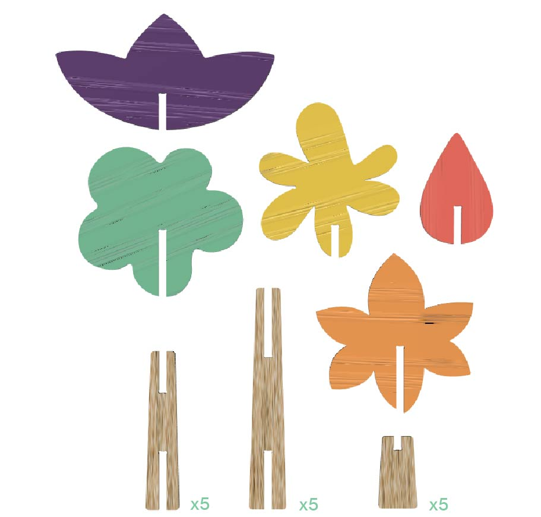

# FLOWERY

<!--
  HERO: idealmente uma pseudo-sessão fotográfica do produto
  (ver tutorial Pletor.ai nos Recursos da disciplina, em
  /Recursos/AI_exps/). Usa attachments/hero.jpg para o frontmatter.
-->

> A liberdade de construir os teus próprios personagens.
## Conceito

O *FLOWERY* é um brinquedo composto por 15 peças de madeira. É destinado a crianças dentro da faixa etária entre os **4-5 anos** e é um brinquedo didático e criativo, permitindo várias tipo de combinações. 

>***Renderização (Fusion 360):** Exemplo de montagem do kit FLOWERY*

>*Peças do kit FLOWERY*
## Enquadramento

Posicionamento em relação ao [contexto](../../contexto.md) de grupo 

O *FLOWERY* insere-se no conceito do grupo através do esquema cromático definido e do fator *mix-n-match*. 

**O que é?**

O *FLOWERY* é um brinquedo modular composto por um conjunto de 15 peças, organizadas em três tipologias distintas: 5 peças longas, 5 peças curtas que funcionam como base estrutural e 5 peças com morfologia inspirada em flores. Esta divisão tipológica permite uma ampla variedade de combinações formais, incentivando a experimentação compositiva e a exploração espacial por parte do utilizador. 

Ao nível do sistema de encaixe, é utilizado um mecanismo aberto baseado em slots, complementado por [^3]*dogbones* nas peças base. Este tipo de solução técnica facilita o processo de montagem e desmontagem, permitindo uma interação intuitiva e acessível, ao mesmo tempo que assegura a precisão dos encaixes e a durabilidade das peças. A escolha de um sistema aberto promove ainda a liberdade criativa, não impondo uma única forma final, mas antes incentivando múltiplas configurações e narrativas construtivas.
## Tecnologia

**Materiais**

O material de seleção para este brinquedo é a madeira de carvalho pela sua robustez. Foram utilizadas de placas de madeira disponibilizadas no FabLab Benfica, de forma a reforçar a sustentabilidade na produção dos brinquedos NESTOR.

**Processo de fabrico**  

Todos os componentes foram cortados numa fresadora [^2]CNC, de forma a assegurar a precisão do corte, com especial atenção às aberturas de encaixe. 

**Pós processamento e acabamento**

No acabamento existiu o especial cuidado do lixar da madeira, de forma a não existirem mais arestas vivas.

**Software paramétrico:** Autodesk Fusion.

- Modelo 3D: [<!-- embed Fusion ou link a360.co -->](https://a360.co/4eHcBEK) 

## Função

**Como se brinca?**

Brincar com o *FLOWERY* apenas leva três etapas. Primeiro monta-se a base com uma peça longa e uma peça pequena, depois a flor no topo e a terceira etapa é da escolha da criança, podendo retirar e juntar qualquer peça com outra. 

**Conformidade com a Diretiva 2009/487CE**

O _FLOWERY_ cumpre os requisitos essenciais da Diretiva 2009/48/CE.  Em relação às propriedades Químicas (EN 71-3), o projeto prevê materiais seguros e acabamentos ecológicos não tóxicos (tintas e vernizes à base de água), garantindo a total segurança no contacto tátil prolongado.

## Apresentação

>*Imagens geradas com o auxílio com a Gemini IA.*

>*Prancha resumo.*

## Processo
[Ver processo completo →](processo.md)

[^2]: **Controlo Numérico Computadorizado**.

[^3]: **corte de alívio arredondado** feito nos cantos internos de um encaixe.
