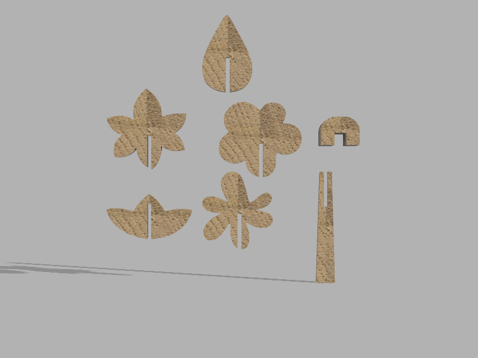
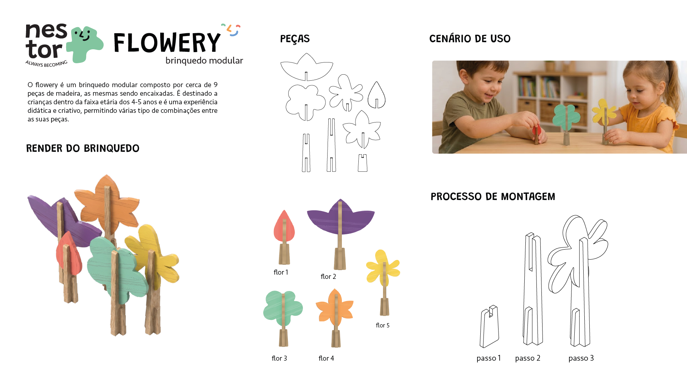
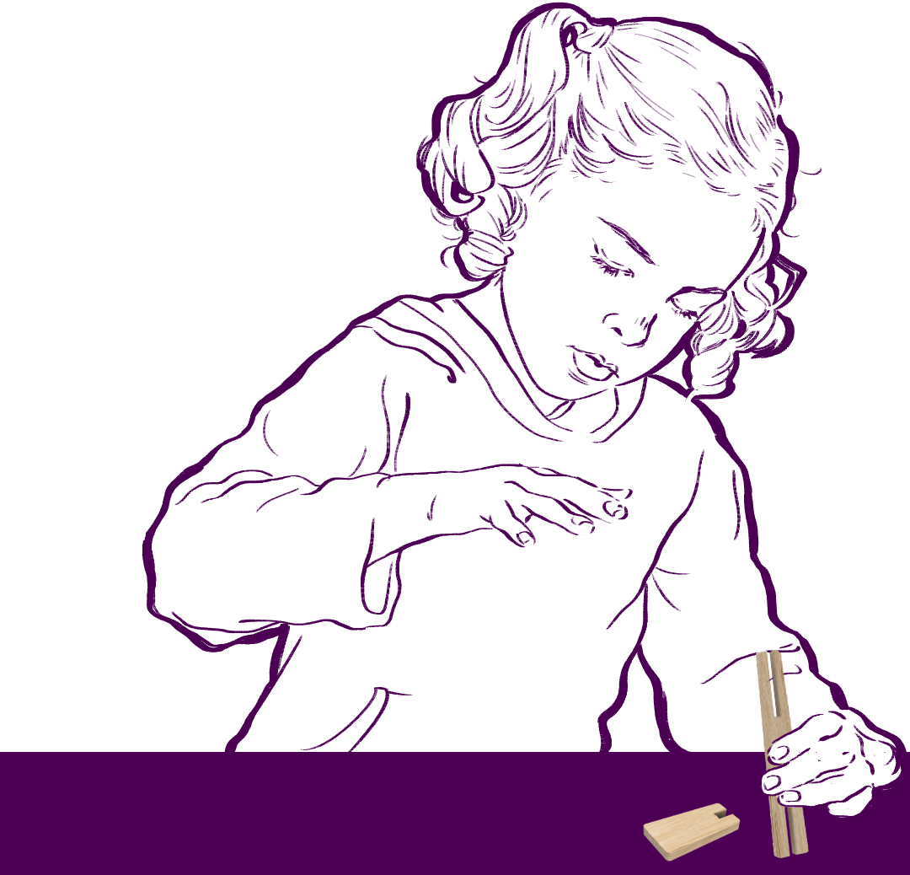
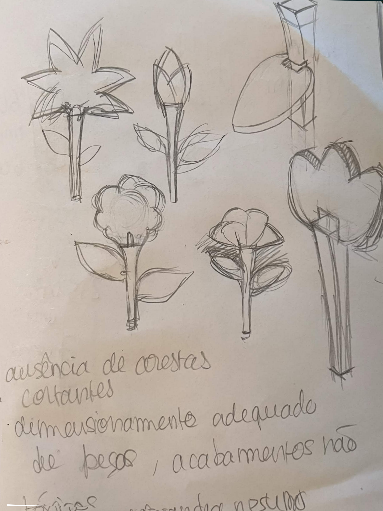
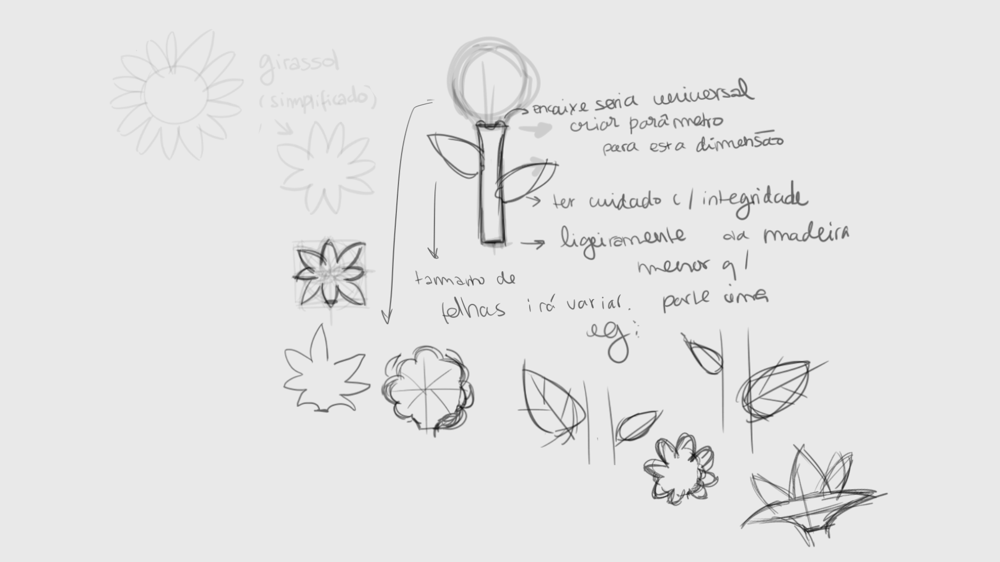
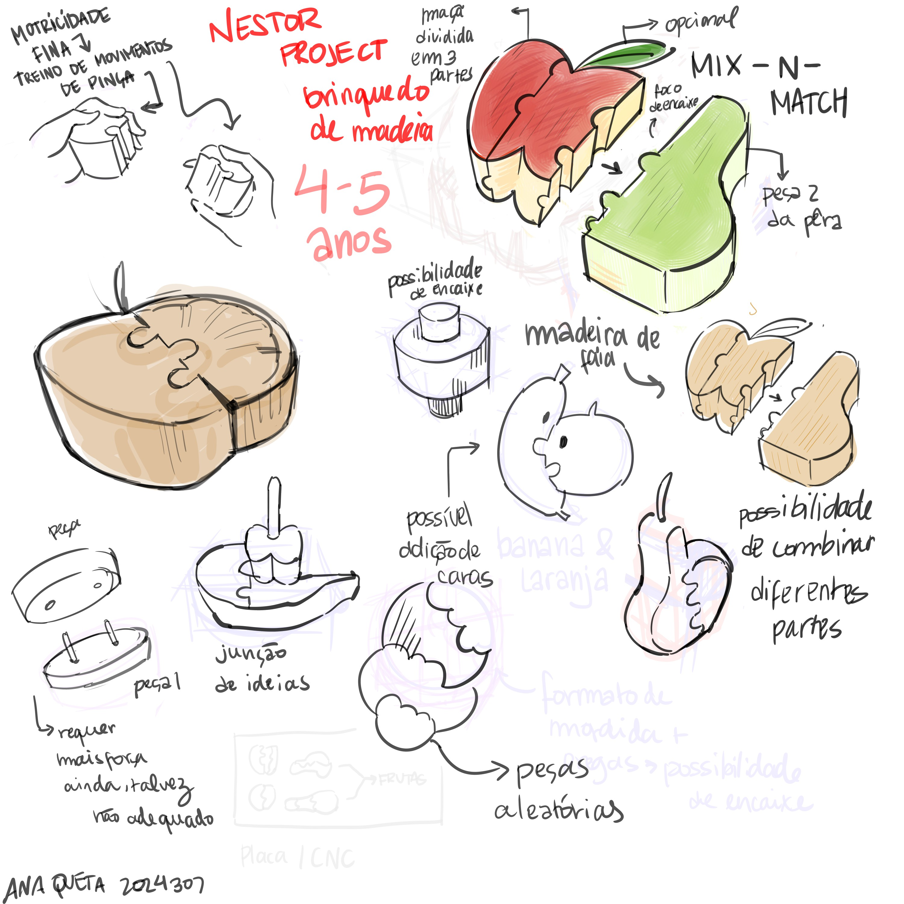
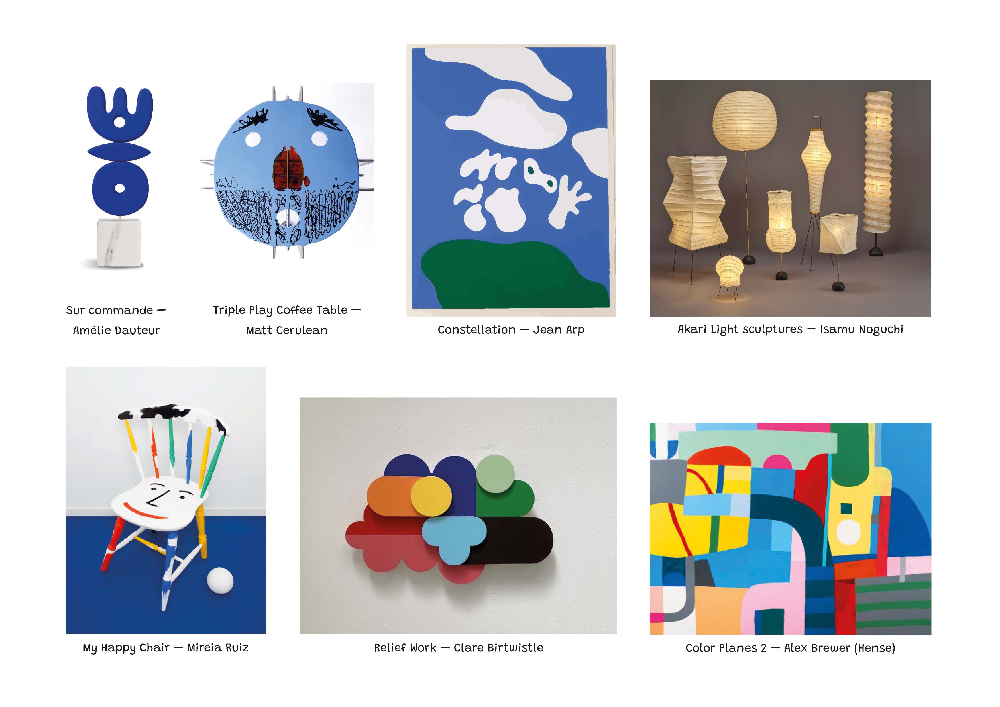
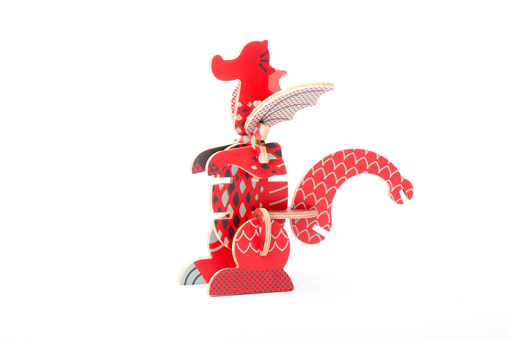
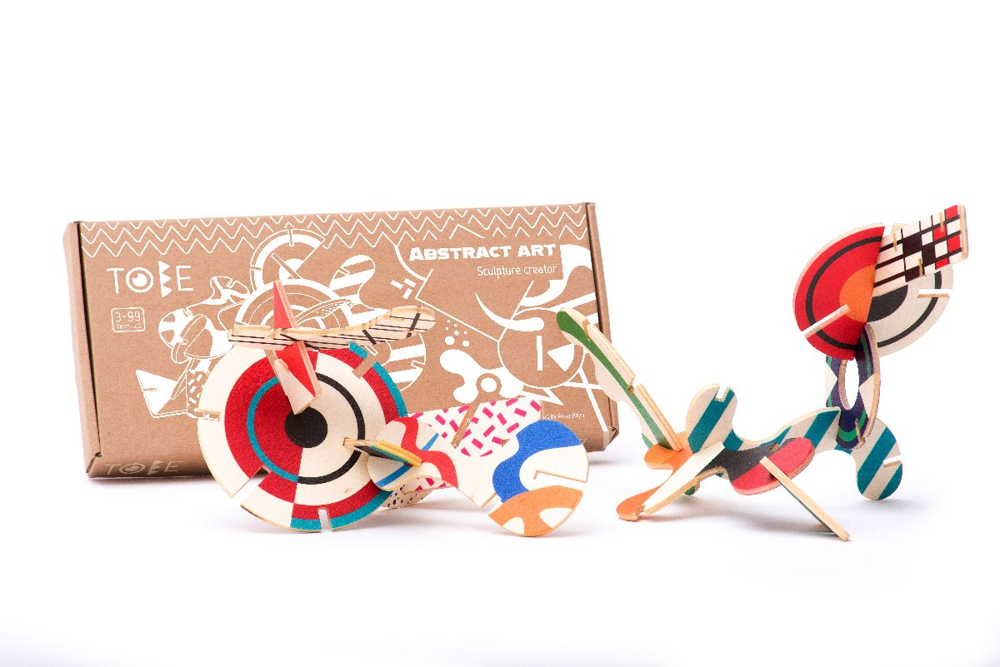

# Processo
## 1. Renders finais

Fotografias em estúdio com fundo branco do(s) protótipo(s) final(is).

## 2. Modelo de teste (Fusion)

## 3. Modelos 3D

[https://a360.co/4nqYoPa](https://a360.co/4eHcBEK)
## 4. Esboços e Pranchas-Resumo

>*Prancha resumo final.*

>_Desenho de criança a brincar com as peças.

>*Esboços manuais.*

>*Esboços digitais.

>*Primeira prancha resumo.*
## 5. Pesquisa

### 5.1. Aspectos valorizados do moodboard, desconstrução da forma 

Tendo como ponto de partida a moodboard, valorizei a simplificação das formas e a palete de cores escolhida em coletivo (que teve como referência as cores da moodboard). 

### 5.2. Objetos de referência

**Mythical creatures - Bajo Toys**

>*Design por Sebastian Rubiano*.

**Abstract Art - Bajo Toys**

>*Design por Anna Bajor*.
## 6. Outros Elementos

Outros materiais relevantes para a preparação do conceito (entrevistas, observação, testes com utilizadores, notas, leituras, inspirações).
