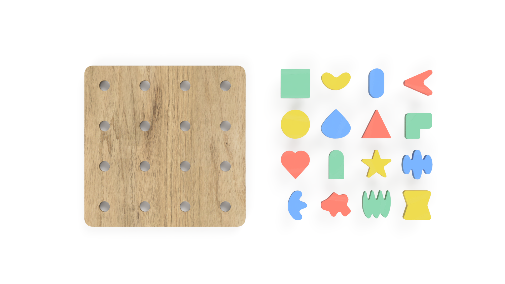
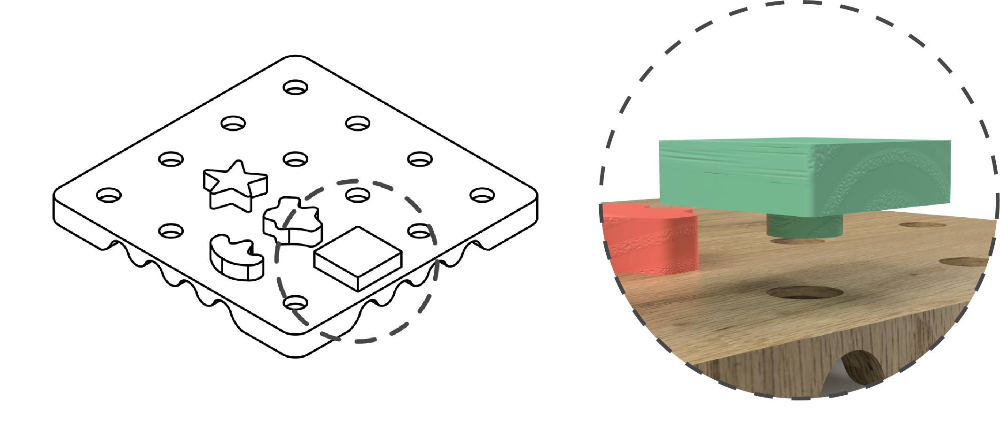
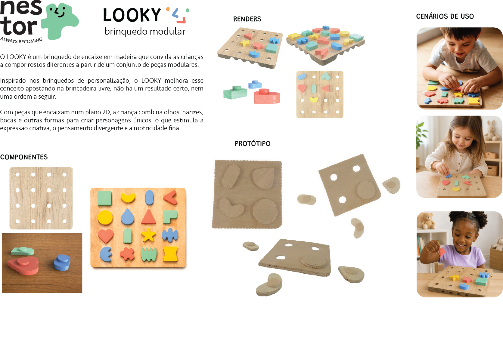

# LOOKY

> Compõe a tua cara. Inventa a tua personagem. 
## Conceito

>**Renderização (Fusion 360):** Exemplos de montagem do *LOOKY*

#### Ideia central
Um sistema onde a criança combina livremente peças de várias formas num tabuleiro, criando caras divertidas, absurdas ou completamente inesperadas, podendo até representar-se a si própria. Sem um resultado certo, sem uma ordem a seguir e sem se sentirem limitadas.

#### O que é?
Um tabuleiro de madeira com 16 furos e 16 peças de formas distintas. Cada peça encaixa por pressão em qualquer buraco com um clique satisfatório, tornando a própria montagem parte da experiência. A criança pode compor uma cara reconhecível, explorar combinações ao acaso, ou simplesmente deixar-se guiar pelo que as formas lhe sugerem.

A interação é intuitiva e sem ferramentas, o fácil pressionar e soltar das peças convida à experimentação contínua. Embora contribua para o desenvolvimento da motricidade fina e estimule a imaginação, o foco do _LOOKY_ é, antes de mais, o prazer de brincar.

Com a longevidade em mente, todas as peças partilham o mesmo sistema de encaixe, garantindo compatibilidade com qualquer tabuleiro que venha a existir na gama. Seguindo a filosofia _NESTOR_, é ainda possível adquirir peças adicionais avulso, ampliando as possibilidades criativas à medida que a criança cresce, e mantendo a experiência sempre surpreendente.

O tabuleiro conta ainda com um recorte em zig-zag nas laterais que serve um triplo propósito: facilitar o transporte, reduzir o peso e, funcionar como recipiente para transportar as peças. É possível levar as peças espalhadas, no verso do tabuleiro, ou organizadas, utilizando os encaixes.

Inspirado nos brinquedos clássicos de personalização como o _Mr. Potato Head_, o _LOOKY_ parte dessa tradição e liberta-a, sem posições fixas nem combinações predefinidas, qualquer peça encaixa em qualquer lugar, devolvendo à criança total autoria sobre o resultado.

>**Renderização (Fusion 360):** Componentes

#### Para quem?
- **Crianças:** Pequenos criadores dos 4 aos 5 anos que querem inventar personagens únicos sem instruções nem limites. Nestas idades, o jogo simbólico e a capacidade de atribuir significado a formas e objetos está em pleno desenvolvimento, o encaixe por pressão é suficientemente intuitivo para ser explorado de forma autónoma, enquanto a total liberdade de composição oferece espaço para a criatividade crescer sem barreiras. 
- **Pais e Educadores:** Adultos que valorizam o jogo simbólico, a expressão emocional e um brinquedo que estimula o pensamento divergente. 

#### Porquê?
Ao explorar um sistema de encaixe simples e completamente aberto, a criança atribui significado às formas, descobre combinações inesperadas e transforma cada montagem numa narrativa própria.

## Enquadramento

#### Posicionamento em relação ao [contexto](../../contexto.md) de grupo
O _LOOKY_ insere-se no conceito do grupo através do tema dos rostos, usando-o como ponto de partida. O tabuleiro e as 16 peças definem uma estrutura mínima, mas a ausência de posições corretas devolve à criança total liberdade interpretativa: as mesmas formas podem ser olhos, orelhas, ou simplesmente formas, e o rosto resultante pode ser humano, absurdo, imaginário ou um autorretrato.

Desta forma, o LOOKY posiciona-se no contexto do grupo como um facilitador do jogo livre e da expressão criativa, onde a estrutura existe apenas para dar um ponto de partida, e a imaginação da criança faz o resto.

#### Objeto da inspiração principal

- **Objeto 1** — Mr.Potato Head
## Tecnologia

#### Materiais
O _LOOKY_ é produzido em **madeira de carvalho**, reconhecida pela sua robustez e resistência ao desgaste, características indispensáveis num brinquedo sujeito a montagem e desmontagem repetidas.
#### Processos de Fabrico
- **Corte CNC**
O processo de produção é inteiramente digital, assente em corte CNC para todas as componentes: o tabuleiro (250 × 250 mm), as 16 peças (50 × 50 mm) e os furos de encaixe. Este processo garante a precisão necessária para que o encaixe por pressão funcione de forma consistente, firme o suficiente para manter as peças no lugar, acessível o suficiente para uma criança manusear sem dificuldade. O projeto foi também concebido para ser adaptável a diferentes espessuras de material, entre 18 e 45 mm, tornando-o flexível em termos de produção.
- **Pós-Processamento e Acabamento**
Após o corte, todas as peças passam por lixagem manual para eliminar arestas e farpas, e recebem pintura com certificação de segurança para crianças.
#### Software Paramétrico
Todo o projeto foi modelado digitalmente no software paramétrico Autodesk Fusion 360.
##### Modelo 3D
https://a360.co/3S1agf1
## Função

#### Como se brinca
Não há instruções nem regras – open-ended play. A criança pega nas peças, experimenta, troca, retira e recomeça tantas vezes quantas quiser. O _LOOKY_ é um brinquedo de processo, não de resultado: o que importa não é a cara final, mas tudo o que acontece até lá chegar.

>*Imagem gerada por Inteligência Artificial (NoteGPT)*

#### Idade-alvo
O _LOOKY_ destina-se a crianças entre os 4 e os 5 anos. Nesta fase, a criança já consegue manusear peças com precisão suficiente para o encaixe por pressão, e está numa etapa em que atribuir significado a formas e inventar narrativas a partir delas é uma atividade natural e espontânea. À medida que cresce, a possibilidade de adquirir peças adicionais mantém o brinquedo relevante e a experiência sempre renovada.
#### Montagem
A montagem é completamente livre e sem ferramentas. Cada peça encaixa por pressão em qualquer um dos 16 furos do tabuleiro, o clique de entrada confirma que a peça está no lugar, e a remoção é igualmente simples. Não existe uma sequência correta, nem uma configuração final a atingir: a criança monta, desmonta e recomeça sempre que quiser, no seu próprio ritmo.

## Apresentação

> *Prancha-resumo de apresentação (versão atualizada)*

## Processo

[Ver processo completo →](processo.md)
