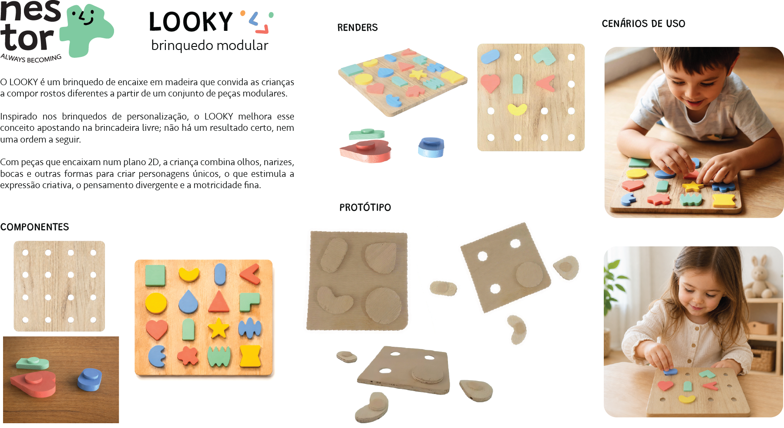
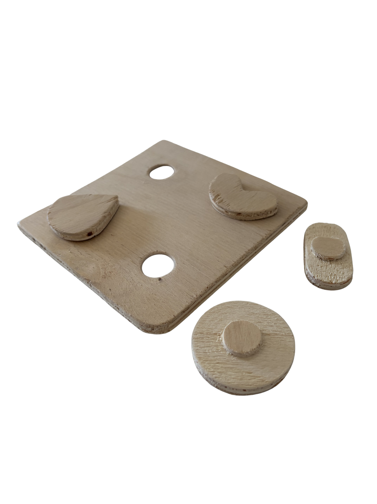
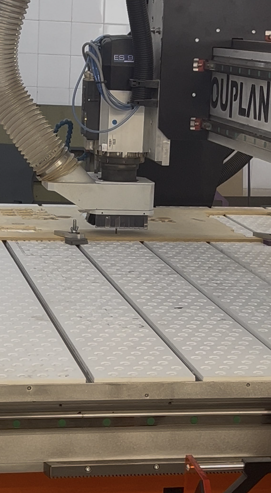
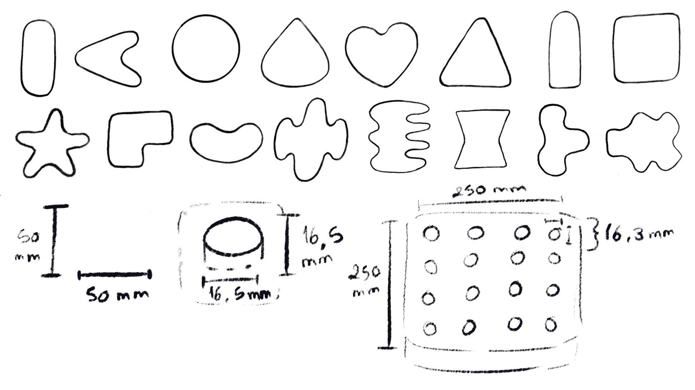
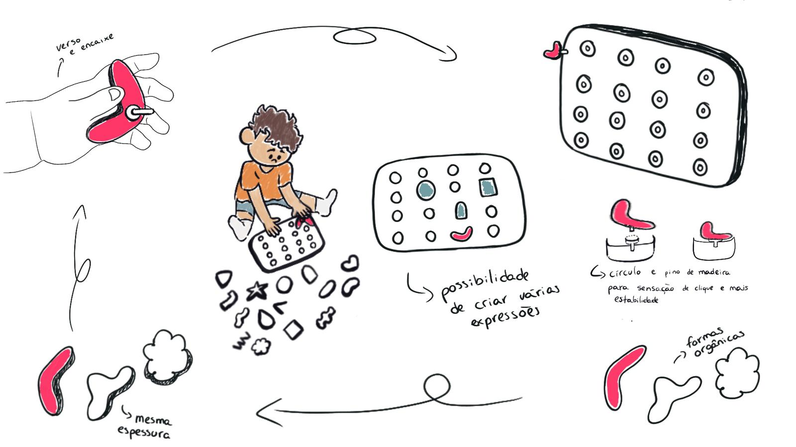
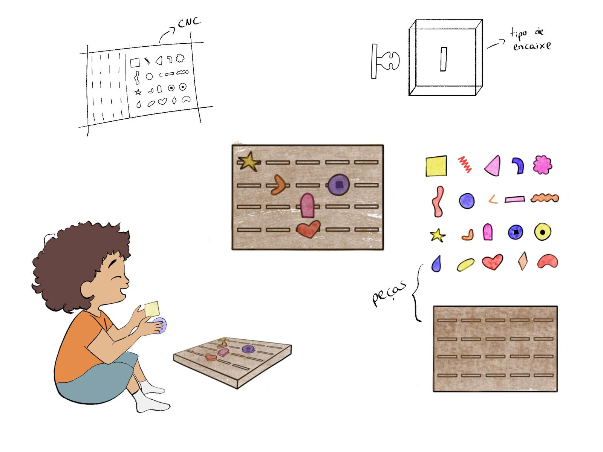
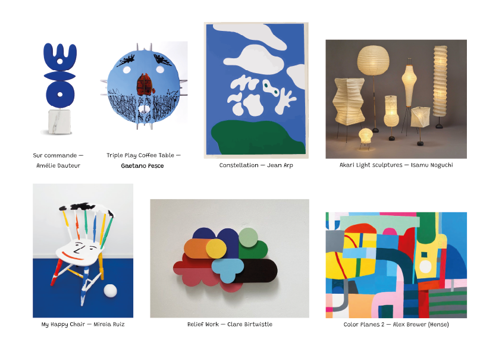
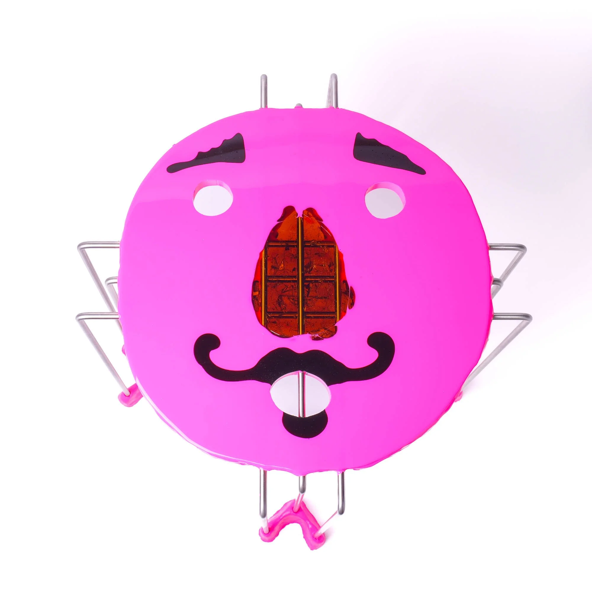

# Processo

## 1. Modelos 3D

#### Modelo 3D Principal - Autodesk Fusion 360

O modelo final do LOOKY está dividido em três secções: uma onde as peças estão arrumadas de forma organizada nos encaixes do tabuleiro, outra com exemplos de utilização e ainda no plano horizontal, pronta para corte em CNC.

Embed do Fusion (visualização do modelo paramétrico)

https://a360.co/4osv0Zb

Ao longo do projeto, utilizei o Fusion 360 para visualizar e testar as minhas ideias num plano 3D. Desta maneira, foi-me possível perceber que o que pensei que inicialmente funcionaria quando realizei o primeiro esboço não se adequava à tecnologia. A evolução da modelação acompanhou as alterações feitas nos esboços.

https://a360.co/4xsi75t 

https://a360.co/4xrYevB

https://a360.co/4vMvUCn 

## 2. Pranchas-resumo

A prancha final foi aperfeiçoada após receber feedback, acrescentando mais cenários de uso, diferentes exemplos de montagem (renders) e um zig-zag na lateral do tabuleiro. 

> *Prancha-resumo de apresentação (versão atualizada)*

> *Prancha-resumo de apresentação (pré-feedback)*

## 3. Protótipo

Apenas com o protótipo realizado em CNC é que me foi possível perceber que aspetos melhorar no projeto. A folga estava apertada, o que fez com que as peças precisassem de muita pressão para entrar, dado isto, alterei a folga de 0,15 mm para 0,20 mm. Para o protótipo utilizei madeira com 10 mm de espessura, o que não seria ideal para este tipo de brinquedo.

> Protótipo final ***LOOKY***

## 4. Processo de Prototipagem

Realizei um protótipo em madeira na máquina CNC OUPLAN STEEL 3020 no Fablab Benfica. Após o corte, foi necessário lixar manualmente cada componente do projeto.

## 5. Esboços e Pranchas-resumo iniciais

>*Alteração das formas e sistema de encaixe*

Posteriormente, precisei de repensar no formato de certas peças, embora parecessem funcionar, algumas eram demasiado estreitas, não deixando assim espaço para o círculo.

>*Prancha-Resumo atualizada*

Decidi então reformular as minhas peças, eliminando algumas e tornando o tabuleiro arredondado, com um encaixe baseado em puzzles de animais, com um círculo menor dentro de um maior.

Com feedback do professor, decidi fazer um tabuleiro com o meio mais fino, facilitando no transporte e tornando o brinquedo mais leve. Também alterei os encaixes, já que com a folga certa, a sensação de clique que queria transmitir seria alcançável com apenas um círculo.

>*Prancha-Resumo inicial*

No início da fase de experimentação, fiz um brinquedo com 20 peças e com um encaixe de chave (*key*), onde a criança iria inserir a peça numa ranhura e girá-la cerca de 90 graus. Mais tarde percebi que esta ideia não se adequava à tecnologia disponível, ou se fosse possível realizá-la, implicaria imprimir mais uma peça, que unisse a peça principal ao encaixe e posteriormente ao tabuleiro.

Penso que ao imprimir mais peças, o propósito do projeto _NESTOR_ seria refutado, já que o critério principal é o reaproveitamento de madeira de imobiliário, para construir brinquedos. Assim, evitando peças “extra” seria possível ocupar o espaço disponível na madeira com outro projeto.

## 6. Pesquisa

O conceito geral do grupo guiou a pesquisa do _LOOKY_. As peças, que tiveram como foco a linguagem mais arredondada e colorida, surgiram de várias sessões de esboços.

### 6.1. Aspectos valorizados do moodboard, desconstrução da forma (o que distingue o programa formal)

Partindo do moodboard desenvolvido em grupo, percebi quais seriam os elementos que unem todos os nossos projetos: as formas orgânicas, cores chamativas e uma forte componente lúdica. Com isto, valorizei o trabalho do artista Gaetano Pesce, desenhei algumas formas que fossem versáteis o suficiente para fazer vários tipos de caras e permitir uma brincadeira aberta através da interpretação.

### 6.2. Objetos de referencia

As minhas principais referências ao longo deste projeto foram os trabalhos de Gaetano Pesce e ainda o brinquedo Mr.Potato Head. Desta forma, consegui chegar a um brinquedo modular que permite recrear vários tipos de expressões diferentes de maneira completamente livre.  
>*Triple Play Coffee Table - Matt Mauve de Gaetano Pesce*

>*Mr.Potato Head*